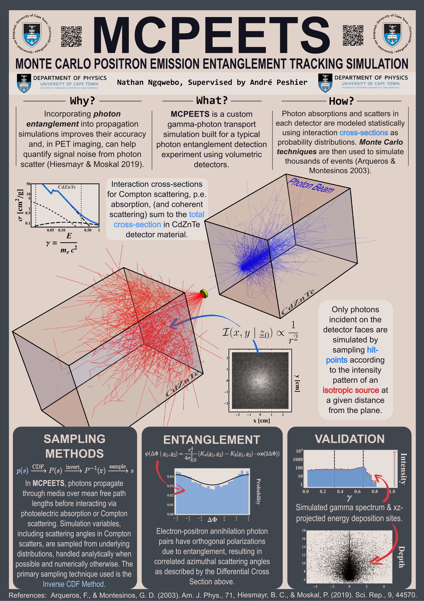

<!-- Improved compatibility of back to top link: See: https://github.com/othneildrew/Best-README-Template/pull/73 -->

<!--
*** Thanks for checking out the Best-README-Template. If you have a suggestion
*** that would make this better, please fork the repo and create a pull request
*** or simply open an issue with the tag "enhancement".
*** Don't forget to give the project a star!
*** Thanks again! Now go create something AMAZING! :D
-->

<!-- PROJECT SHIELDS -->
<!--
*** I'm using markdown "reference style" links for readability.
*** Reference links are enclosed in brackets [ ] instead of parentheses ( ).
*** See the bottom of this document for the declaration of the reference variables
*** for contributors-url, forks-url, etc. This is an optional, concise syntax you may use.
*** https://www.markdownguide.org/basic-syntax/#reference-style-links
-->
[![Contributors][contributors-shield]][contributors-url]
[![Forks][forks-shield]][forks-url]
[![Stargazers][stars-shield]][stars-url]
[![Issues][issues-shield]][issues-url]
[![MIT License][license-shield]][license-url]
[![LinkedIn][linkedin-shield]][linkedin-url]

<!-- PROJECT LOGO -->
 

  

<h3 align="center">MCPEETS</h3>

  

    Photon transport simulation built in Mathematica
     
     
    <a href="#usage">View Demo</a>
    ·
    <a href="https://github.com/Richlyannointed/MCPEETS/issues/new?labels=bug&template=bug-report---.md">Report Bug</a>
    ·
    <a href="https://github.com/Richlyannointed/MCPEETS/issues/new?labels=enhancement&template=feature-request---.md">Download</a>
  

<!-- TABLE OF CONTENTS -->

  
Table of Contents

  <ol>
    <li>
      <a href="#about-the-project">About The Project</a>
    </li>
    <li>
      <a href="#getting-started">Getting Started</a>
      <ul>
        <li><a href="#prerequisites">Prerequisites</a></li>
        <li><a href="#installation">Installation</a></li>
      </ul>
    </li>
    <li><a href="#usage">Usage</a></li>
          <ul>
        <li><a href="#explore">Explore</a></li>
      </ul>
    <li><a href="#contributing">Contributing</a></li>
    <li><a href="#license">License</a></li>
    <li><a href="#acknowledgments">Acknowledgments</a></li>
  </ol>

<!-- ABOUT THE PROJECT -->
## About The Project

`MCPEETS` is a gamma ray propagation simulation tool that includes azimuthal correlation
effects stemming from polarization entanglement in annihilation photon emission. It allows for representative
modeling of gamma ray propagation, integrating azimuthal scattering correlation effects arising from the entangled polarization states of the emitted photon pairs.

### Poster

 

(<a href="#readme-top">back to top</a>)

<!-- GETTING STARTED -->
## Getting Started

This is an example of how you may give instructions on setting up your project locally.
To get a local copy up and running follow these simple example steps.

### Prerequisites

This project is built using [Mathematica](https://www.wolfram.com/siteinfo/). To explore it, you will need a valid license. If you are a UCT student, you can access Mathematica through the university's resources.

### Installation

1. Download latest release: zip file with Mathematica Notebook and accompanying [NIST](https://physics.nist.gov/PhysRefData/Xcom/html/xcom1.html) cross-section data (.csv)
2. Run the notebook in the same folder as the cross-section data

(<a href="#readme-top">back to top</a>)

<!-- USAGE EXAMPLES -->
## Usage

  

### Explore
- Changing detector _dimensions_
- Preparing _cross-section data_ for different detector materials
- Switching between an isotropically emitting source and photon _beams_
- Simulating as many photon pairs as your machine can handle

(<a href="#readme-top">back to top</a>)

<!-- CONTRIBUTING -->
## Contributing

If you have a suggestion that would make this better, please fork the repo and create a pull request. You can also simply open an issue with the tag "enhancement".

1. Fork the Project
2. Create your Feature Branch (`git checkout -b feature/AmazingFeature`)
3. Commit your Changes (`git commit -m 'Add some AmazingFeature'`)
4. Push to the Branch (`git push origin feature/AmazingFeature`)
5. Open a Pull Request

(<a href="#readme-top">back to top</a>)

### Top contributors:

<!-- LICENSE -->
## License

Distributed under the MIT License. See `LICENSE.txt` for more information.

(<a href="#readme-top">back to top</a>)

<!-- ACKNOWLEDGMENTS -->
## Acknowledgments

* Project supervised by Prof. A. Peshier in the Department of Physics at UCT.

(<a href="#readme-top">back to top</a>)

<!-- MARKDOWN LINKS & IMAGES -->
<!-- https://www.markdownguide.org/basic-syntax/#reference-style-links -->
[contributors-shield]: https://img.shields.io/github/contributors/Richlyannointed/MCPEETS.svg?style=for-the-badge
[contributors-url]: https://github.com/Richlyannointed/MCPEETS/graphs/contributors
[forks-shield]: https://img.shields.io/github/forks/Richlyannointed/MCPEETS.svg?style=for-the-badge
[forks-url]: https://github.com/Richlyannointed/MCPEETS/network/members
[stars-shield]: https://img.shields.io/github/stars/Richlyannointed/MCPEETS.svg?style=for-the-badge
[stars-url]: https://github.com/Richlyannointed/MCPEETS/stargazers
[issues-shield]: https://img.shields.io/github/issues/Richlyannointed/MCPEETS.svg?style=for-the-badge
[issues-url]: https://github.com/Richlyannointed/MCPEETS/issues
[license-shield]: https://img.shields.io/github/license/Richlyannointed/MCPEETS.svg?style=for-the-badge
[license-url]: https://github.com/Richlyannointed/MCPEETS/blob/master/LICENSE.txt
[linkedin-shield]: https://img.shields.io/badge/-LinkedIn-black.svg?style=for-the-badge&logo=linkedin&colorB=555
[linkedin-url]: https://linkedin.com/in/nathanngqwebo
[product-screenshot]: graphics/screenshot.png
[Next.js]: https://img.shields.io/badge/next.js-000000?style=for-the-badge&logo=nextdotjs&logoColor=white
[Next-url]: https://nextjs.org/
[React.js]: https://img.shields.io/badge/React-20232A?style=for-the-badge&logo=react&logoColor=61DAFB
[React-url]: https://reactjs.org/
[Vue.js]: https://img.shields.io/badge/Vue.js-35495E?style=for-the-badge&logo=vuedotjs&logoColor=4FC08D
[Vue-url]: https://vuejs.org/
[Angular.io]: https://img.shields.io/badge/Angular-DD0031?style=for-the-badge&logo=angular&logoColor=white
[Angular-url]: https://angular.io/
[Svelte.dev]: https://img.shields.io/badge/Svelte-4A4A55?style=for-the-badge&logo=svelte&logoColor=FF3E00
[Svelte-url]: https://svelte.dev/
[Laravel.com]: https://img.shields.io/badge/Laravel-FF2D20?style=for-the-badge&logo=laravel&logoColor=white
[Laravel-url]: https://laravel.com
[Bootstrap.com]: https://img.shields.io/badge/Bootstrap-563D7C?style=for-the-badge&logo=bootstrap&logoColor=white
[Bootstrap-url]: https://getbootstrap.com
[JQuery.com]: https://img.shields.io/badge/jQuery-0769AD?style=for-the-badge&logo=jquery&logoColor=white
[JQuery-url]: https://jquery.com 
[example]: graphics/demo.webp
